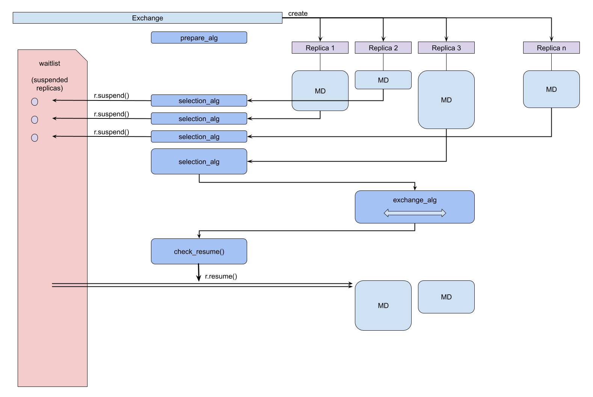

.. _introduction:

************
Introduction
************

Replica-Exchange (RE) is a family of simulation techniques used to enhance
sampling and more thoroughly explore phase space of simulations. RE simulations
involve the concurrent execution of independent simulations which interact and
exchange information. Replica Exchange (RE), a method devised as early as 1986
by Swendsen et. al., is a popular technique to enhance sampling in molecular
simulations. Replica Exchange Molecular Dynamics (REMD) was first formulated in
1999 by Sugita and Okamoto. Initially REMD was used to perform exchanges of
temperatures, but was later extended to perform other exchange types. Over the
years, REMD has been adopted by many scientific disciplines including chemistry,
physics, biology and materials science.

Most RE implementations however are confined within their parent molecular
dynamics (MD) packages. This is limiting because it becomes difficult to
implement new RE methods, or apply exchange methods across MD packages.

RepEx is designed to be scalable, flexible, and above all, extensible. New
developments in replica exchange (RE) should not only be limited to specific MD
packages in which they were developed. RepEx aims to decouple the development of
new advanced sampling algorithms from specific MD engines, and allows users to
easily implement their cumstom RE algorithms and plug them into RepEx. RepEx
also supports multiple MD engines including AMBER and GROMACS.

RepEx is available under the MIT License.

The general control flow is shown in the following figure:

Figure 1. schematic control flow during an replica exchange run.

The `Exchange` class will instantiate a set of `Replica` objects, according to
the provided configuration.  Each replica will start to run an MD simulation.
Once that simulation is completed, the replica will trigger the selection
algorithm in the exchange class.  If that algorithm does not find any exhange
pairs, it will suspend that replica and add it to it's `waitlist`.

At some point, some completed replica (in this figure it is `replica.3`) will
have a sucessfull run of the selection algorithm, and will find one or more
pairs of replicas in the waitlist for which data can be exchanged (in the
figure, only one pair is found).  The actual exchange is performed by adding an
`exchange` task to the replica which triggered the selection.  Once that
exchange is completed, the `check_resume` method in the `Exchange` class is
triggered and will resume all replicas which participated in the exchange.
Thise replicas will then start a new simulation.

